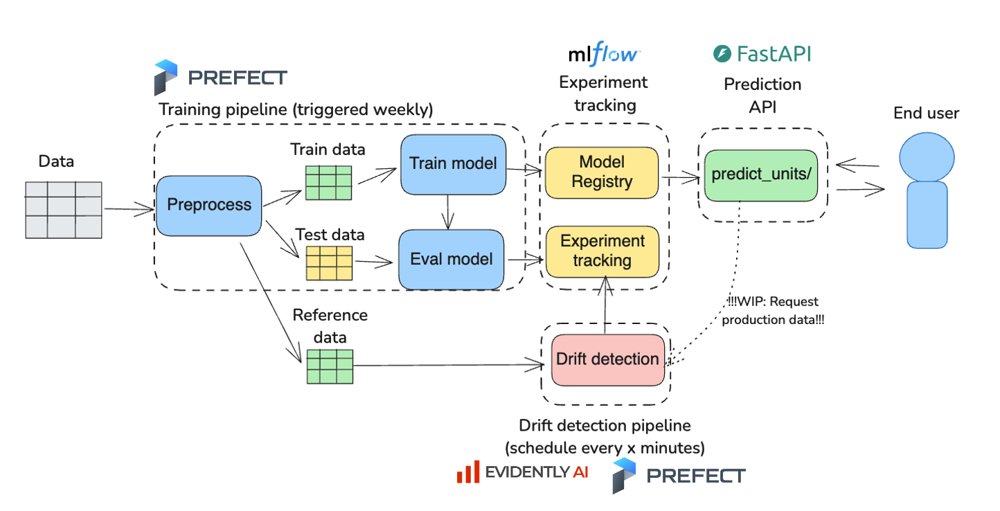

# MLE: Forecasting model

This repo consists of code that trains a model that forecasts the Unit Sales one week ahead in case of a promotion or no-promotion on an article level.
The training is scheduled to run weekly orchestrated by prefect. Model metrics and hyperparameters are logged to MLFlow for each run and the model is registered in the model registry.
The trained model is deployed to Fast-API which has an endpoint with whiich you can request predictions for single records.
There is also a (dummy) drift-detection pipeline (again orchestrated by prefect) in place which runs an automated drift-detection with Evidently ona the training data and a simulated drift dataset.
Drift metrics are now logged to MLFlow under the 'Drift Detection' experiment. In future work, this pipeline should request the real production data from the predict API to perform automated drift detections.

## Plan & todos

- [x] Refactor code from notebook into modules: preprocess.py, train.py, & predict.py.
- [x] Set up mlflow tracking in train.py.
- [x] Create API in api.py to serve the model.
- [x] Add logic in predict.py to load model from mlflow model registry.
- [x] Create docker-container to serve mlflow.
- [x] Create docker-container to train model and register model to mlflow.
- [x] Create docker-container for api.py.
- [x] Add some model monitoring.
- [x] Orchestration of training
- [x] Set a schedule for retraining
- [ ] Create a batch predict endpoint.
- [ ] Log batch input and output in API, so that the drift-detector can read this data.
- [ ] Have drift-detector read in data from the API.
- [ ] Automatic retraining based on drift.
- [ ] Think about CI/CD, promoting models, dev -> main environments.
- [x] Unit tests
- [ ] Integration tests.
- [ ] Mount volume to mflow for persisting data?
- [ ] Set up S3 & postgres for better storage management.

## Architecture and process flow

A diagram showing the process flow:



The process flow is as follows:

Training-pipeline & Experiment Tracking:
1. A training pipeline preprocesses the data (from the local folder: `./data/raw/`) and splits it into a train and test set. 
2. A random-forest regression model is trained on the train data and evaluated on the test data.
3. Model evaluation metrics and hyperparameters are logged to an MLFlow experiment.
4. The trained model is registered in the MLFLow model-registry.
5. The whole pipeline is orchestrated by prefect and is scheduled to run once a week.

Prediction API
1. There is a python-script (`wait_for_mlflow.py`) in place that checks whether there is a model registered in MLFlow or not, this is necessary for the first time running this project otherwise the API will crash.
2. The `api.py` module loads the lateset trained model from the MLFlow model registry.
3. It is served via FastAPi for single row predictions via the /predict_units endpoint.

Drift detection (WIP)
1. There is a drift detection pipeline that is orchestrated with prefect to run every 5 minutes.
2. For now, it loads in the data and preprocesses it to create a reference data-set.
3. It uses Evidently-AI to create a drift report given production data. The drift metrics are then logged to a 'Drift Detection' experiment in MLFlow.
4. For now, the production is dummy data generated by shifting and shuffling the reference data to simulate drift.
5. In future work, the drift-pipeline should request production data fro the Prediction-API.
6. It would also be preferable to log drift-metrics to a monitoring dashboard such as Grafana.
7. Logic could be implemented to trigger automatic retraining if drift is detected.

## Usage

This project consists of multiple services that run in docker-containers. These are as follows:

1. A training pipeline orchestrated by Prefect to run every Sunday at midnight (check the Prefect UI to monitor this).
2. MLFlow UI to check the training parameters, metrics, and registered models.
3. A Prefect UI to monitor the training pipeline.
4. A fast-API prediction endpoint to make predictions with your model. NOTE: there is a `wait_for_mlflow.py` script that checks if the model has been registered before starting the API.
5. A drift-detection pipeline that runs every 10 minutes. This is a dummy pipeline that detects drift on simulated drifted production data. In future, this should read in data from the predict-API. 

You can start all containers by running the docker-compose file (NOTE: you need to place the dataset.csv in the 'data/raw/' folder!) :

```
docker compose up --build
```
(NOTE: older docker version: `docker-compose up --build`)

You can reach the different services here:

- MLFlow: http://localhost:5050/
- Prefect: http://localhost:4200/
- Prediction-API: http://localhost:8000/ (NOTE: This will not start up immediately, it will wait for a model to be registered. Check the Prefect-UI for the progress of the training pipeline!)


## Setup for development

Anaconda environment:
```
conda create -n mle_forecasting python=3.11
conda activate mle_forecasting
pip install -e '.[lint,test]'
```

Next install your pre-commit hooks:
```
pre-commit install
pre-commit run --all-files
```


### Testing
This is still WIP, but there is one testing module for the preprocessing.py module. These tests can be run by running `pytest` in the command prompt.